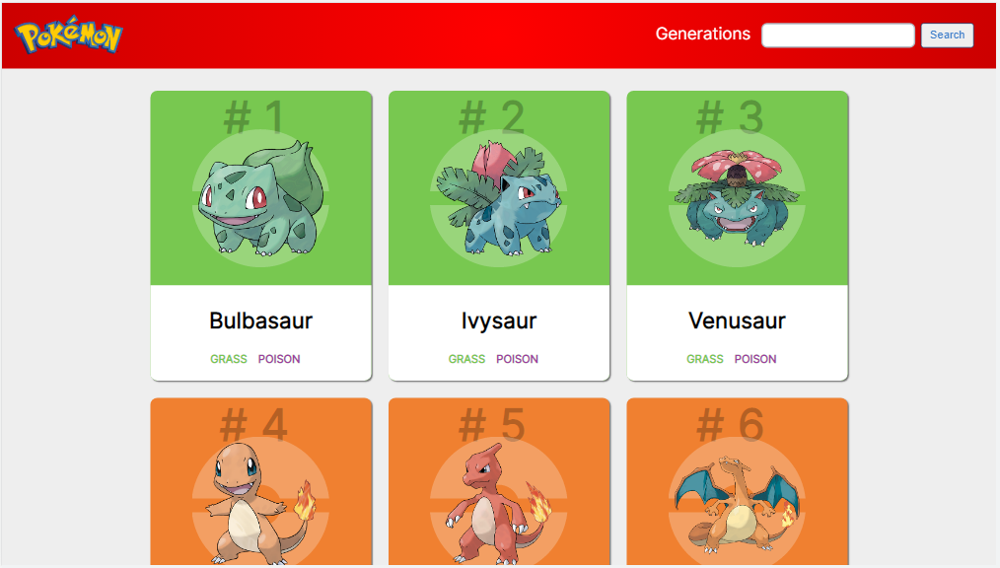
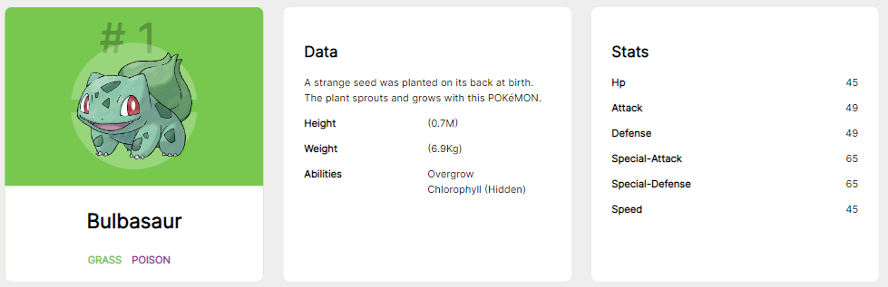
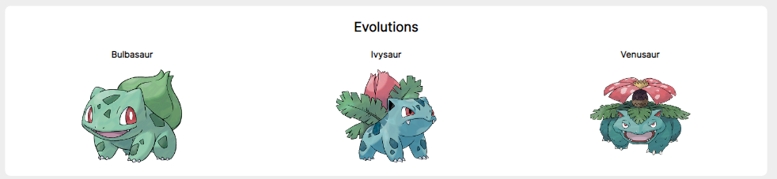

<h1 align="center">Pokedex</h1>

## Demo

Accede a la web [Any Pokedex](https://anypokedex.vercel.app/)

## Lista de contenido

- [Descripción](#descripción)
- [Capturas](#capturas)
- [Tecnologías](#tecnologías)
- [Instalacion y Comandos](#instalacion-y-comandos)

## Descripción

<p>Any-Pokedex es una web en la cual se puede buscar y visualizar diferentes datos de cada uno de los pokemones</p>

## Capturas

  
  
  

## Tecnologías

```
-> React.js
-> Hooks
-> Wouter
```

## API

Any-Pokedex utiliza [PokeApi](https://pokeapi.co/), una API RESTful, la cual propociona una gran cantidad de datos sobre pokemon.

## Instalacion y Comandos

- Instalacion:

`npm install`

- Visita:

`https://localhost:3000/`